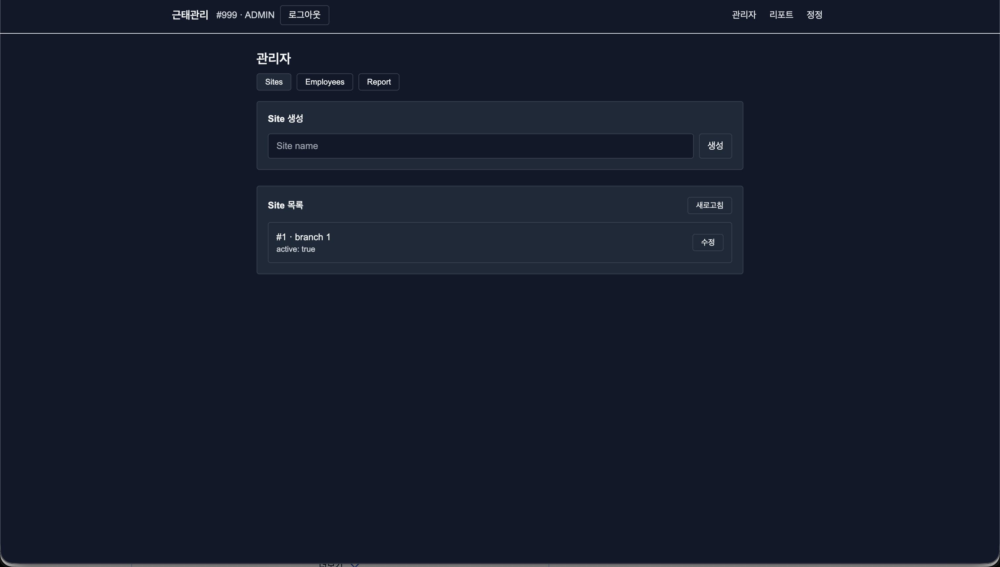
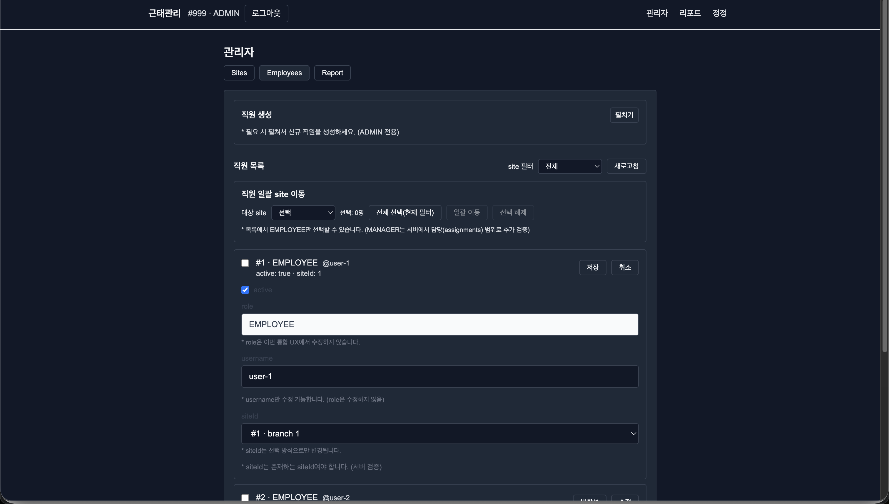
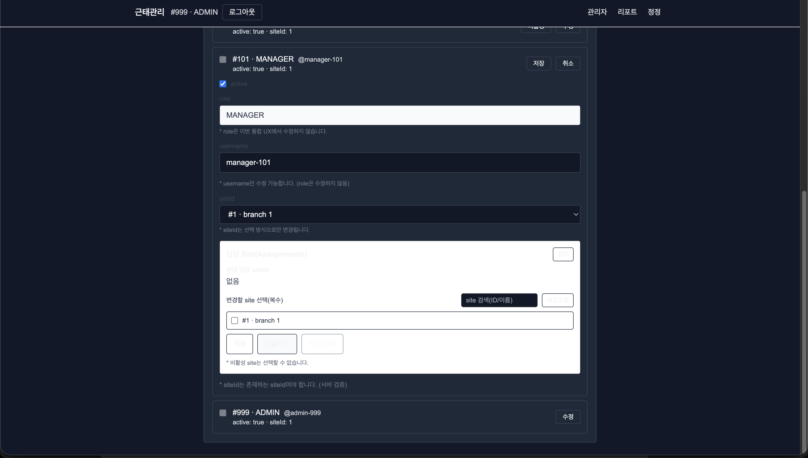
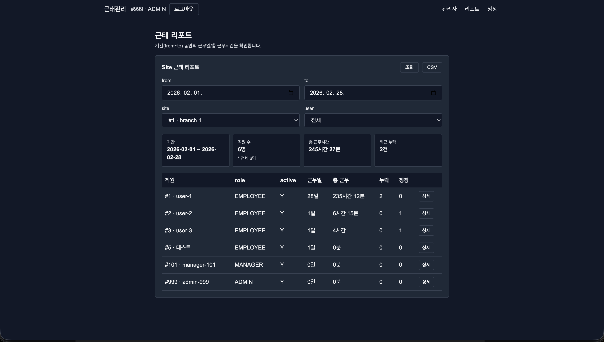
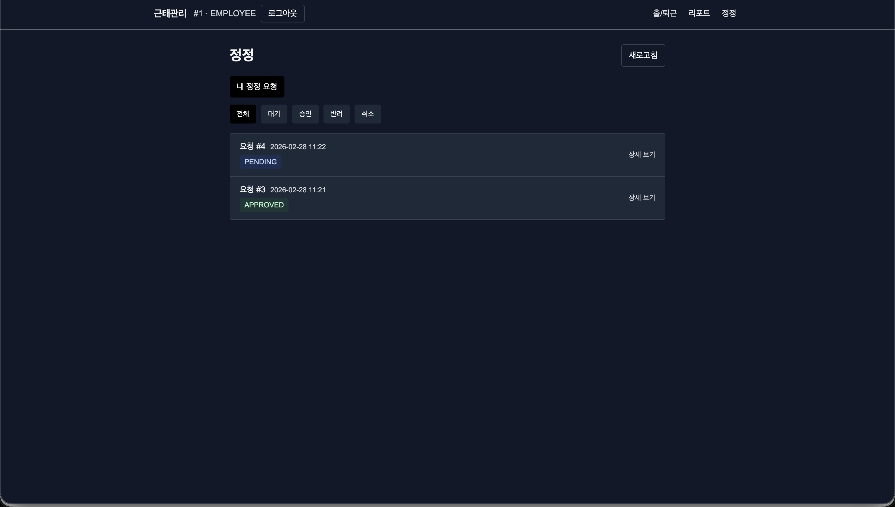
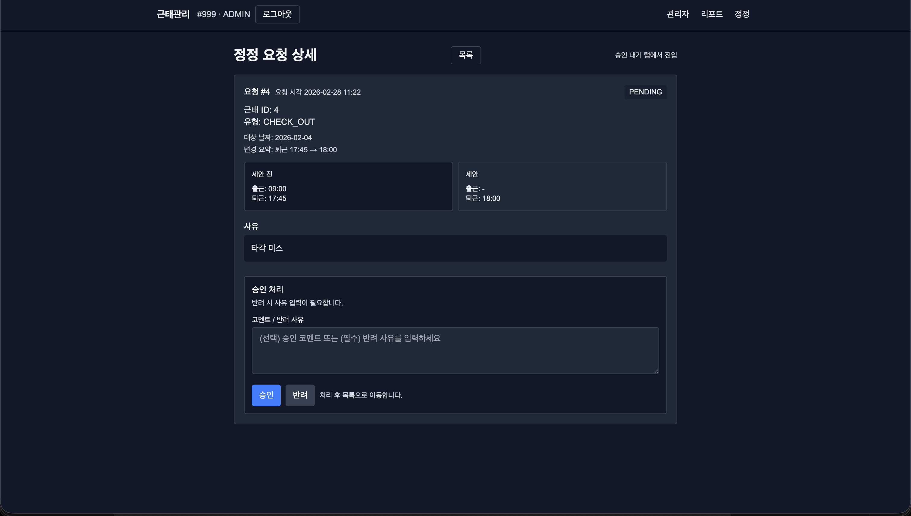

# Attendance System (근태관리 웹앱)

소규모~중소 규모 조직을 대상으로 한 **근태(출/퇴근) 기록, 정정 요청, 관리자 운영(Admin/Manager)** 기능을 제공하는 웹 애플리케이션입니다.  
본 프로젝트는 **Contract-first(문서 계약 우선)** 방식으로 API/에러 계약을 고정하고, 프론트/백엔드가 동일 계약을 기준으로 동작하도록 설계했습니다.

> 모바일 환경에서도 사용 가능한 간단한 UX(Contract)
> - 출근: 사진 촬영/선택 → 업로드 → 즉시 상태 반영  
> - 퇴근: 즉시 처리(즉시 상태 반영)

---

## Screenshots (Mobile / Dark Mode)

| 화면 | 설명 |
|---|---|
|  | **Admin 통합 페이지(탭)**: Sites / Employees / Report 탭 기반 운영 콘솔 |
|  | **Employees 운영**: 직원 목록 + 편집(활성/비활성, site 변경, username 수정 등) |
|  | **Assignments 운영 UX**: 담당 site를 체크박스 multi-select로 대량 적용 |
|  | **관리자 리포트**: 기간 필터 + 집계 카드 + 테이블(운영 관점 조회) |
|  | **정정 목록**: 내 요청/승인대기 탭 및 상태 배지 |
|  | **정정 상세**: 승인/반려/취소 등 역할 기반 액션 |

---

## Demo Flow (30s)

### EMPLOYEE
1. 로그인 → `/attendance`
2. 출근(사진 업로드) → today 상태 즉시 반영
3. `/attendance/report` 기간 리포트 조회 → CSV 다운로드(표시/전체)
4. 정정 요청 생성 → `/corrections`에서 상태 확인/취소

### MANAGER / ADMIN
1. 로그인 → `/admin/sites` (Sites/Employees/Report 탭)
2. Sites/Employees 운영(조회/수정/생성 등)
3. 관리 대상 정정 요청 처리 → `/corrections?tab=approvable`에서 승인/반려
4. 관리 대상 기간 리포트 조회(관리 스코프 기준)

---

## Architecture

```mermaid
flowchart LR
  subgraph FE[Frontend (Next.js / TS)]
    UI[Pages & Components]
    API[apiFetch + API wrappers]
  end

  subgraph BE[Backend (Spring Boot / JPA)]
    AUTH[Auth (Bearer JWT / X-USER-ID fallback)]
    DOM[Domains: attendance / correction / employee / site]
    ERR[Error Contract: 6-field ApiErrorResponse]
  end

  DB[(DB)]

  UI --> API --> BE
  AUTH --> DOM --> DB
  ERR --> UI
```

---

## Repository Structure

- `backend/attendance-app/` : Spring Boot 백엔드
- `frontend/attendance-frontend/` : Next.js 프론트엔드
- `docs/` : Contract(최상위 스펙), API 문서, 에러 계약, 감사 체크리스트

---

## 핵심 기능

### EMPLOYEE
- 출근/퇴근 처리
- 정정 요청 생성/조회/취소
- 개인 리포트(기간 리포트)

### MANAGER / ADMIN
- 운영 정책 전제: **본인 근태 입력(출/퇴근/개인 월별/개인 리포트)은 비필수**, 대신 관리 대상 중심 운영
- 관리 대상 직원의 리포트 조회
- 관리 대상의 정정 요청 조회/승인/반려
- 관리자 운영(Admin Ops): Site/Employee/Assignments 관리

---

## 기술 스택

### Frontend
- Next.js(App Router) + React + TypeScript
- Tailwind CSS
- API Wrapper(`apiFetch`) 기반 표준 에러 계약 처리
- 모바일 UX/다크모드 가독성 대응

### Backend
- Spring Boot(Java) + JPA/Hibernate
- 도메인 단위 패키지 구조(Attendance / Correction / Employee / Site / Auth / Error)

---

## Key Design Decisions

### 1) Contract-first 문서 체계
- 최상위 계약: `docs/ATTENDANCE_SYSTEM_SPEC.md`
- API 계약: `docs/api/*` (`00-index`, `10~40`, `90-errors`, `95-error-mapping`)
- Gate(감사 기준): `docs/SPEC_AUDIT_CHECKLIST.md`

> 구현은 문서 계약을 준수하며, “임의 재설계/구조 변경/가정 추가”를 제한하는 운영 규칙을 둡니다.

### 2) 인증 컨텍스트 기반 사용자 식별
- 요청 파라미터/바디로 `userId`를 받지 않고 **인증 컨텍스트**에서 결정
- (권장) `Authorization: Bearer <JWT>`
- (개발/호환) JWT가 없는 환경에서는 `X-USER-ID` 헤더 fallback

### 3) 표준 에러 계약
- 에러 응답 6필드 고정: `timestamp, status, error, code, message, path`
- `UNAUTHORIZED`는 401로 매핑(문서 계약에 포함)
- 프론트는 이 계약을 기준으로 일관된 사용자 메시지 UX를 제공

---

## What I solved (대표 이슈)

- **Next.js 15 CSR bailout**: `useSearchParams()` 사용 페이지에 `Suspense` boundary 적용하여 build/prerender 에러 해결
- **Admin 페이지 무한 재요청 루프**: 의존성 안정화(`useMemo` 등)로 반복 생성/반복 fetch 문제 제거
- **JWT 친화형 로그인 전환**: Bearer 기반 인증 흐름을 중심으로 정리하고, 개발 환경에서는 X-USER-ID fallback 유지
- **다크모드/모바일 가독성**: 헤더/관리자 탭/리포트/정정(Corrections) 화면 전체 대비 개선

---

## 로컬 실행

### Backend
```bash
cd backend/attendance-app
./gradlew bootRun
```

### Frontend
```bash
cd frontend/attendance-frontend
npm install
npm run dev
```

### 환경 변수(Frontend)
`frontend/attendance-frontend/.env.local`
```bash
NEXT_PUBLIC_API_BASE_URL=http://localhost:8080
```

---

## 문서
- API 인덱스: `docs/api/00-index.md`
- 근태: `docs/api/10-attendance.md`
- 정정: `docs/api/20-correction-requests.md`
- 관리자 운영: `docs/api/30-admin-ops.md`
- 에러 계약: `docs/api/90-errors.md`, `docs/api/95-error-mapping.md`

---

## 개발/협업 규칙(요약)
- Diff/패치 생성 전 **SSOT(첨부된 최신 소스/문서)** 기준으로 작업
- 백엔드 SSOT는 브랜치+타임스탬프 zip로 공유(파일명 충돌 방지)

---

## 로드맵(요약)
- 정정 신청 UX를 리포트 페이지로 이관(월별 페이지 폐지 방향)
- 관리자/매니저 운영 기능 고도화(검색/대량 처리/정합성 검증)
- JWT 만료/재로그인 UX 보강(`/api/auth/me`)
